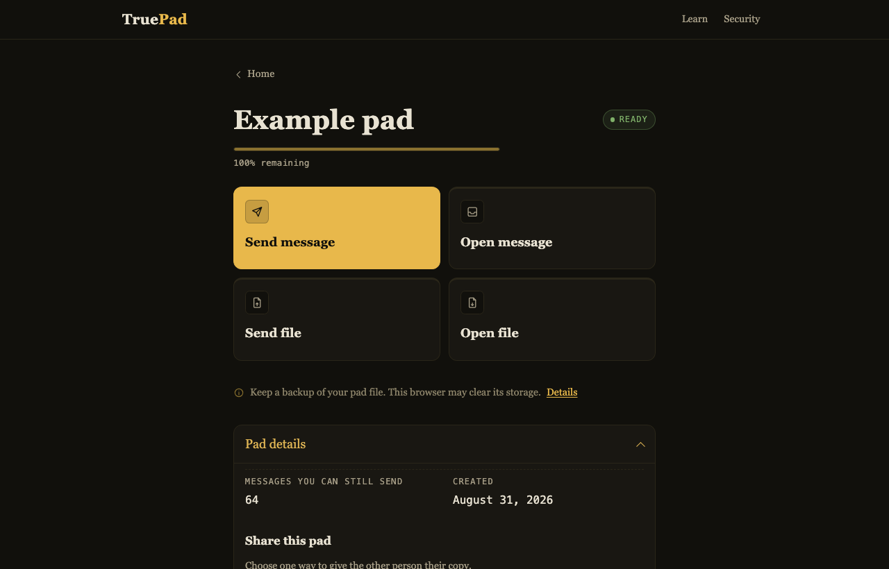

# TruePad 2

**A working educational cryptographic system about the hard part of one-time
pads: keeping pad material single-use, and keeping the security claims honest,
across crashes, stale copies, restores, two-party state, browsers, and the
delivery of the pad itself.**



## The XOR is the easy part

Anyone can write `plaintext ^ pad`. What is hard — and what this repository is
actually about — is keeping the one-time pad's assumptions intact once real
software is involved: crashes mid-write, a stale copy of a pad file, two peers
who each think they hold the only copy, a restored backup, a delivery that
failed halfway, browser storage the operating system may evict, and a handoff
that may or may not have completed.

Every one of those is a chance to use a pad symbol twice, and reuse is the one
failure a one-time pad cannot survive. So the project has a single governing
rule, and the code follows it even where it costs something:

> **LOSS IS ACCEPTABLE. REUSE IS NOT.**

Forced to choose between losing pad material and risking that a symbol serves
twice, TruePad loses the material. A lost transfer is fixed by making a new pad.
A reused pad cannot be fixed at all.

**This is not a recommendation to use one-time pads for real traffic.** It is a
working, audited implementation that states on every screen what it does not do.

## Three guarantees, deliberately not merged

The most common mistake about one-time pads is treating "the cipher is
information-theoretic" as though it described the whole system. It does not.
TruePad 2 keeps three claims apart, because they rest on different assumptions:

| | What it covers | What it rests on |
| --- | --- | --- |
| **1. Private pad handoff** | delivering the raw pad by a secret route — in person, or a channel only the two of you control | If the OTP premises hold — source quality, secrecy, non-reuse, authentication — this is the route relevant to the **conditional information-theoretic** deployment path. TruePad **cannot prove physical randomness**, and says so. |
| **2. Sealed online pad delivery** | delivering the pad as a `.tps2` file through an ordinary channel | **Computational.** X-Wing draft-10 (ML-KEM-768 with X25519), HKDF-SHA-256, AES-256-GCM. This is **not** an information-theoretic Internet-delivery claim. |
| **3. Messages, once both sides hold the pad** | ordinary TruePad 2 messaging | One-time pad encryption plus one-time **Wegman–Carter** authentication. The theorem is information-theoretic under its premises; material from a software CSPRNG inherits that generator's assumptions. |

A short form worth remembering, as long as you keep hold of what it refers to:

> **PQC delivers the pad. OTP encrypts the messages.**

That describes **sealed online delivery only**. Ordinary TruePad 2 messages do
not use X-Wing, ML-KEM or AES-GCM — once the pad is in place the delivery
cryptography has finished its job and never runs again.

Nothing here should be read as claiming that messages crossing the Internet
inherit the one-time pad's unconditional guarantee. They do not. That guarantee
is about the cipher, under its premises, once both people already hold the pad —
it says nothing about how the pad got there.

## TruePad 2 — the current system

**[Browser Edition](https://systemslibrarian.github.io/TruePad/) — the main
experience.** A working two-party app: create a pad, share it once, then send
and open messages and files. Give the pad over by **private handoff** *or* by
**sealed online delivery**. No backend, no account, no telemetry, nothing
uploaded — it runs entirely on your device.

**Format v2 — the current authenticated system.** Underneath the Browser
Edition: OTP encryption with one-time Wegman–Carter authentication, durable
single-use state, rollback and witness protections, and sealed pad delivery. The
`truepad2` CLI works the same store from a terminal, and adds the TPM/native
distinctions.

**[Learn — the OTP exhibit](https://systemslibrarian.github.io/TruePad/learn.html).**
The teaching page: Shannon's three conditions, watching a pad burn and run out,
why reuse fails, secrecy versus integrity, and the DeckBook comparison.

## Where to go next

- **[How online pad delivery works](docs/HOW-ONLINE-PAD-DELIVERY-WORKS.md)** — plain English, no cryptography required
- **[Security Policy](SECURITY.md)** — what is in scope, and how to report
- **[Product claims](docs/PRODUCT-CLAIMS.md)** — every claim, and what proves it
- **[Browser security](docs/BROWSER-SECURITY.md)** — the Browser Edition's model and limits
- **[Store Format v2](docs/FORMAT-V2.md)** — the normative message format
- **[Sealed Pad Transfer](docs/SEALED-PAD-TRANSFER.md)** — the normative transfer specification
- **[Release audit](docs/SEALED-PAD-TRANSFER-RELEASE-AUDIT.md)** — how the shipped product was verified against it
- **[Changelog](CHANGELOG.md)**

## Release status

**TruePad 2.0.0 is the project's first formally tagged release.** It went out
against a release audit whose verdict was **B — release ready with documented
non-blocking limitations**, and those limitations are real and written down
rather than solved: a browser profile restore can rewind local state, the OPFS
write fallback is not truly atomic, the word ceremonies depend on humans actually
performing them, an archived sealed file carries harvest-now-decrypt-later
exposure, and no software can prove that anything was physically erased.

`package.json` reads `2.0.0`. The number reflects the current Format v2 / Browser
generation, and there was never a formal TruePad 1.0 — 2.0.0 is where the formal
version history begins, not the second entry in it.

## Earlier teaching CLI: `truepad-pad` (v1)

`truepad-pad` predates Format v2 and is kept because it teaches something the
authenticated path cannot show you: what it feels like when secrecy is not
integrity. It is **not** the current system, and not a co-equal product.

> [!WARNING]
> **v1 envelopes are unauthenticated, on purpose.** An attacker who knows the
> plaintext format can flip chosen bits and change what the receiver reads,
> undetectably; a forged `startOffset` makes the receiver burn pad material it
> should have kept. That hazard is the lesson. **Format v2 — the Browser Edition
> and `truepad2` — is the authenticated path.** Do not mistake v1 for the secure
> one.

Its full documentation is in [the `truepad-pad` section](#the-pad-cli-truepad-pad--reuse-safe-pad-handling-not-secure-messaging)
below.

## The exhibit

DeckBook's shuffled-deck keystream only *looks* like a one-time pad: 52 cards
folded mod 26 carry ~225.6 bits of entropy where 52 independent letters need
~244.4, and no permutation can hand out one independent uniform symbol per
plaintext symbol. TruePad's *combiner* is the real thing, built to make the
difference visceral: the pad running out, the per-symbol burn, and the
crib-drag attack that leaks against a reused DeckBook keystream but learns
nothing against a pad of independent uniform symbols.

### The three Shannon conditions, and what this code can honestly claim

1. **Key ≥ message** — the pad is generated before encryption, and encryption
   refuses outright if the surviving pad is shorter than the message. No
   wraparound, no truncation, no borrowing — ever.
2. **Independent uniform symbols** — every pad symbol is one draw,
   range-reduced by rejection sampling (letter mode: uniform 0–25, add-mod-26;
   byte mode: uniform 0–255, XOR). Never `Math.random()`, never a modulo fold.
   **The draws come from `crypto.getRandomValues()`, a deterministic random
   bit generator.** A pad of *n* symbols therefore carries at most the
   generator's state entropy (on the order of 256 bits), not *n* × bits per
   symbol, and this condition holds *computationally* — against an adversary
   who cannot tell the generator from true randomness — not
   information-theoretically. Operator-supplied material (`Pad.fromExternal`)
   is tagged `external`; the code records that assertion and cannot verify
   physical origin.
3. **Used exactly once** — consuming a symbol *deletes* it from the pad in
   memory, and the receiver refuses any envelope at or below its high-water
   mark. Within one process no API can return a burned value. Across
   processes, crashes and copies, that guarantee needs a durable burn and a
   mark kept apart from the pad file — which is the CLI's job, below. The
   browser exhibit deliberately keeps no pad state.

### The verdict has two lines

Station 4 grades the **combiner** (unconditional given the three conditions —
a theorem about the structure, whatever the source) and the **source**
separately: `computational — bounded by the platform DRBG state` for a
generated pad, `declared external — provenance asserted by the operator, NOT
verified by this tool` for supplied material. A pad that passes all three
conditions with a computational source is the honest common case, and the
page says so instead of rounding it up.

### What crosses the wire

Only the envelope — `{ label, startOffset, consumed, payload }` — ever touches
the public channel; the pad goes out of band. The receiver *seeks* to
`startOffset`, burning everything it skips, and refuses any envelope at or
below what it has already burned: a replay, a late arrival and an overlapping
window all land in the same typed refusal, before any burn.

**The envelope is not authenticated**, and that cuts two ways. A modified
payload decrypts to modified plaintext with no alarm (station 6 is the live
proof: perfect secrecy is not integrity). A modified `startOffset` drives the
seek, so anyone who can rewrite an envelope on the channel can make the
receiver burn forward through its remaining pad — pad can be *destroyed* from
the channel, never reused. The receiver cannot refuse this: without
authentication a forged `startOffset` is indistinguishable from a legitimate one
that advanced because earlier envelopes were lost, and any cap on how far a seek
may jump would refuse exactly the recovery a dropped message needs. Refusal
becomes possible only once the envelope is authenticated — the non-goal above. There is no message authentication here, and the v1 envelope never gains
it. Wegman–Carter over the envelope is the seam, and it costs additional
pad — built, for a separate store format, as `truepad2` below.

### What is deliberately not here

No message authentication (above). No post-quantum anything, no KEM, no key
transport of any kind: the pad travels out of band, and that constraint is the
exhibit's thesis, not a gap to engineer around. No browser persistence of pad
state: IndexedDB syncs, profiles get backed up, and JavaScript strings cannot
be zeroed, so the page keeps its pads in memory and says so.

### Core modules (pure, dependency-free, unit-tested)

| Module | Purpose |
| --- | --- |
| `src/core/pad.ts` | Rejection-sampled or external pad material tagged with its source and direction; irreversible consume/burn; seek by burn-forward; high-water mark; pad-material ledger |
| `src/core/cipher-otp.ts` | Envelope in/out; letter-mode (add-mod-26) and byte-mode (XOR) encrypt/decrypt with role, label, shape, reuse and exhaustion checks — every refusal typed and before any burn |
| `src/core/attack-otp.ts` | Crib dragging: leaks on keystream reuse, ties on a true OTP; shared comparator |
| `src/core/meter.ts` | Pad-remaining vs. message-length meter state and the pad-material ledger (symbols × bits per symbol — material, not entropy) |
| `src/core/verdict.ts` | Shannon three-condition grader, split into COMBINER and SOURCE lines, for a pad and for a DeckBook deck |

## The pad CLI: `truepad-pad` — reuse-safe pad handling, not secure messaging

`src/cli/` is a tool that owns pad state on disk so that a crash, a stale copy
of the pad file, or two processes cannot make a pad symbol serve twice (with
the one limitation stated below). It is **not secure messaging**:
envelopes are unauthenticated, an attacker who knows the plaintext format can
flip chosen bits of a message undetectably, and a forged `startOffset` makes the
receiver burn pad. The tool prints that on every start. Even with durable burn
and the direction split, a pad **still requires out-of-band delivery, still
has no integrity, and still cannot verify that external material came from a
physical source.** This repository does not recommend one-time pads for real
traffic.

```sh
node bin/truepad-pad.mjs gen    <dir> [--mode letters|bytes] [--size N | --external FILE] [--label PAD-XXXX]
node bin/truepad-pad.mjs burn   <dir> --as A|B (TEXT | --in FILE)       # encrypt with YOUR sending pad, print an envelope
node bin/truepad-pad.mjs open   <dir> --as A|B (ENVELOPE | --in FILE)   # decrypt with your receiving pad: seek, burn, print plaintext
node bin/truepad-pad.mjs status <dir>
```

The verbs name what happens to the *pad*. Exit codes: `0` ok, `2` refused
(nothing burned), `1` usage or I/O error. Requires Node ≥ 22.18 (it runs the
TypeScript sources under Node's built-in type stripping; the launcher checks
the version before importing anything and says so if the runtime is too old).

**Direction.** `gen` produces the *pair*: `<dir>/a-to-b/` and `<dir>/b-to-a/`,
each its own store. The courier copies the whole directory to the peer, so
each party holds both halves and `--as` names which party you are: A burns
`a-to-b` and opens `b-to-a`; B the reverse. Every pad records its direction and
the core refuses a pad whose direction does not fit the declared role, which is
what stops two peers who share one pad from both encrypting with it and burning
identical offsets. The role is a declaration: this guards against the accident,
not against a party who lies about who they are.

**Durable burn** (tested on Linux ext4; see the scope notes in `src/cli/store.ts`
and `lock.ts`). Each half holds `pad.json` (the pad) and `marks.log`
(append-only; one fsynced line per init, burn or open recording the pad's
`nextOffset` afterwards — one past the last burned offset; the highest per
label is the mark the loader checks; kept *separate* from the pad file on
purpose); while a process holds the pair there is an exclusive `lock`. Files
are created owner-only. A directory with only one half (a crash in the middle
of `gen`) is refused by every command. On every `burn` and `open` the order is: write
the new `pad.json` and the mark record → fsync → only then print the envelope
or plaintext. A crash in between loses pad symbols and never reuses them;
losing pad is the correct failure direction. On load, a `pad.json` whose
`nextOffset` is below its label's recorded mark is refused as a regressed copy.

**Limitation, stated:** this defends against crashes and against accidentally
loading a stale copy of `pad.json`. It does not defend against an operator
restoring the whole directory from a backup, which regresses the pad and the
mark together.

**External material.** `gen --external FILE` builds the pair from bytes you
supply (for example from a hardware RNG), split at the byte midpoint — first
half A→B, second half B→A — and tags both `external`. Letter mode
range-reduces by rejection, never modulo. The tool records your assertion of
provenance; it cannot verify where the bytes came from and does not claim to.

| Module | Purpose |
| --- | --- |
| `src/cli/store.ts` | Atomic `pad.json` rewrite, append-only fsynced `marks.log`, load-time regression refusal |
| `src/cli/lock.ts` | `O_CREAT\|O_EXCL` lockfile; a leftover lock is refused with instructions, never auto-broken |
| `src/cli/truepad-pad.ts` | `gen` / `burn` / `open` / `status`, the banner, exit codes |
| `bin/truepad-pad.mjs` | Plain-JS launcher: Node-version gate, then the `.ts` entry |

## What TruePad actually does

Three layers. The first is a theorem, the second is a bound, and the third is
almost all of the code.

### 1. Encryption — the one-time pad

```
C = P XOR K

P = plaintext
K = unused one-time secret material
C = ciphertext
```

That is the whole cipher. It does not depend on factoring, discrete logarithms,
lattices, or any other computational hardness assumption — there is no problem
here for an attacker to be clever about.

If `K` is **genuinely uniformly random**, **secret from the adversary**,
**independent of the messages it protects**, **at least as long as the
plaintext**, and **never reused**, then the confidentiality result is
information-theoretic: the ciphertext alone tells an adversary nothing about
the plaintext beyond its length.

Every word of that condition is load-bearing, and **no software can prove those
source assumptions.** TruePad does not claim to. It states them, records what
you declared, and says plainly that it cannot check them.

### 2. Authentication — one-time Wegman–Carter

Confidentiality is not integrity. An XOR ciphertext is trivially malleable: flip
a bit of `C` and you flip the same bit of `P`. So every v2 record carries a
128-bit `wc-one-time-v1` tag over its authenticated envelope fields, spending 32
bytes of pad material per record whether or not the record ever verifies.

That is what stops a modified ciphertext — or modified authenticated envelope
metadata — from simply being accepted as genuine. The bound is exact and stated
exactly: **ε = 65540 · 2^-128** per attempt at the 1 MiB record cap, and at most
`verifyAttemptLimit` attempts per record. It is a bound with a number attached,
which is the only kind of authentication claim this project makes.

That bound is **information-theoretic**, not computational: `R_s` is a fresh
one-time mask over the hash output, so the tag reveals nothing about `K_s` and
the bound holds against unbounded computation. As with the cipher, the theorem
is one thing and the source is another — see the quantum section below for what
the default device CSPRNG does and does not establish about the `K` and `R`
bytes a real deployment actually used.

### 3. Operational machinery — keeping the hypotheses true

The equation above is one line. Almost everything else in this repository
exists because a real system has to keep that line's hypotheses true over time,
across crashes, copies, and restores:

- consume each encryption byte exactly once
- consume authentication material under its one-time rules
- persist that consumption **before** releasing any output
- refuse replayed, late, or retired material
- detect rollback, to the extent the configured witness permits
- keep a destroyed pad from quietly coming back
- and, where configured on Linux with a TPM, anchor the whole thing to a
  hardware monotonic counter that a restore cannot rewind

> **The XOR is the simple part. The machinery keeps the word "one-time" true.**

Not every deployment gets every layer. The Browser Edition's witness is
browser-local; the CLI's `separate-state-file` is a plain file with the limits
`docs/FORMAT-V2.md` §15 spells out; `platform-monotonic` requires a TPM you
provisioned. Each is documented as exactly what it is, and never as the others.

---

## Two kinds of randomness, and only one of them is a ceremony

**Generate for me** — the default. The Browser Edition calls
`crypto.getRandomValues()`, a cryptographically secure platform random
generator (CSPRNG). Its source claim rests on **platform and computational
assumptions**. TruePad does not call this physically proven randomness and does
not promote this path to an unconditional information-theoretic source claim.

**External True OTP ceremony** — under Advanced options. You supply the
material. TruePad combines every selected source **exactly by XOR**:

```
M[i] = S1[i] XOR S2[i] XOR … XOR Sn[i]
```

No hash. No KDF. No extractor. No whitening. Every source independently
supplies the complete `L = 2·(E + 32·N)` bytes; sources are never concatenated
and never split between them.

The theorem this buys, stated carefully:

> If at least one combined source is actually uniform and independent of the
> others, the combined material is uniform.

Uniformity is one hypothesis, not the premise. For the full one-time-pad
secrecy claim, the source carrying the guarantee must **also** remain secret
from the adversary, be **independent of the messages it protects**, and the
resulting pad material must be **used only once**.

> **TruePad cannot determine whether a supplied file is truly random.**

Selecting the ceremony is a declaration you make. It is never a result TruePad
computed.

---

## What about quantum computers?

TruePad's *message* cipher is **not** "post-quantum cryptography" in the usual
ML-KEM / ML-DSA sense. It is not a lattice scheme, and it is not competing in
that space.

One optional part of the Browser Edition is. **Sealed online delivery** — the
second of the two ways to give someone their copy of a pad, described under
["Two ways to give the other person their copy"](#two-ways-to-give-the-other-person-their-copy)
below — seals the pad with X-Wing (ML-KEM-768 with X25519). That is a *delivery*
mechanism, not the cipher your messages use, and it runs once. But it means a pad
delivered that way carries a **computational** end-to-end claim rather than the
conditional information-theoretic one, and an archived sealed file is subject to
harvest-now-decrypt-later. A pad you carried yourself is untouched by any of
this, and so are the messages either way: after import they use the one-time pad
and Wegman–Carter authentication, not ML-KEM.

The one-time-pad confidentiality theorem predates modern public-key
cryptography and does not rest on a computational problem for an attacker to
solve. Under the genuine OTP assumptions, handing the adversary a classical
supercomputer, a cryptographically relevant quantum computer, or unlimited
computational power does not reveal additional information about the plaintext
from the ciphertext alone. Shor's algorithm does not attack an XOR against
uniform secret material; Grover's does not turn an information-theoretic
construction into a computational one.

> With genuine uniformly random, secret, independent, never-reused pad
> material, OTP confidentiality is **information-theoretic** rather than
> computational. Quantum computing does not change that theorem.

**And immediately, the qualification that makes the sentence honest:**

> TruePad's default device-generated source is a platform CSPRNG and therefore
> carries platform/computational source assumptions. The stronger
> information-theoretic source claim is **conditional** on the external source
> assumptions actually being true — and TruePad cannot verify them.

So: *quantum-resistant by construction; when genuine one-time random material
satisfies the full OTP assumptions, the confidentiality claim is
information-theoretic rather than computational.* That sentence never travels
without the paragraph above it. TruePad is not labelled "unconditionally
secure", "quantum proof", or "perfect secrecy achieved" — those phrases drop
the assumptions, which is the only part that was ever in question.

**Authentication, which is a separate claim, is also not computational.** Under
§5's stated assumptions on the fresh one-time `K_s` and `R_s` material,
`wc-one-time-v1` has the information-theoretic forgery bound given above:
because `R_s` is uniform, fresh, and used once, the observed tag reveals nothing
about `K_s` — it is itself a one-time pad on the hash output — so the bound
holds against unbounded computation. It rests on no hardness problem, so
factoring, discrete logarithms, and lattices are as irrelevant to it as they are
to the cipher. A nonzero ε is not the same thing as a computational assumption.

The same source qualification still applies, and it applies to authentication
exactly as it applies to confidentiality: when that one-time `K` and `R`
material comes from TruePad's default platform CSPRNG, the real deployment
inherits that generator's platform and computational assumptions. The theorem is
information-theoretic; the claim that a particular deployment's bytes satisfy
its ideal-randomness premise is not something software established. TruePad does
not promote device-generated bytes into a physically proven randomness claim —
for the cipher or for the tag.

---

## Walk through a real message

A real v2 envelope, as `truepad2 burn` emits it:

```json
{"formatVersion":2,"pairId":"ed5825e73edd8beb9962abfed3826985","direction":"A->B","sequence":1,"startOffset":4,"ciphertextLength":5,"ciphertext":"1ab8b8a130","tag":"a4354c856b5c7fba93b3d49f95c55f86"}
```

| field | what it is |
| --- | --- |
| `pairId` | which pad this message belongs to |
| `direction` | which side of the shared pad sent it |
| `sequence` | which one-time authentication record was spent |
| `startOffset` | where the consumed one-time-pad region begins |
| `ciphertextLength` | how many ciphertext bytes this record carries |
| `ciphertext` | the OTP-encrypted payload |
| `tag` | the 128-bit Wegman–Carter authenticator |

The same envelope, in TP2 Compact Transport v1 (`docs/COMPACT-TRANSPORT.md`):

```
TP2:AQLtWCXnPt2L65liq_7TgmmFAAEEBRq4uKEwpDVMhWtcf7qTs9SflcVfhg
```

199 characters against 62. **These are two representations of the same
authenticated envelope. The short TP2 form changes transport size, not the
cryptography.** The tag is computed over the envelope's semantic fields and
over neither representation's text, so it is byte-identical either way.

Notice how little of it is ciphertext: five bytes of payload inside an envelope
that must also say which pad, which direction, which authentication record, and
where in the pad the material came from. Those fields are authenticated
alongside the ciphertext — that is why they are there rather than inferred.

---

## Ciphertext may travel publicly. The pad file may not.

This is the distinction most one-time-pad explanations skip, and it is the one
that decides whether any of the above survives contact with reality.

**Anyone who obtains the pad material can read the messages it protects and
forge authenticated messages within the material they hold.** Not "eventually",
not "with enough compute" — immediately, by construction. The pad is the whole
secret.

So for an end-to-end information-theoretic secrecy claim, delivery of the pad
file must **also** not depend on a merely computationally secure channel.
Physical handoff on removable media is the clearest True OTP ceremony.

Email, Dropbox, Google Drive, OneDrive, ordinary cloud storage, and encrypted
messengers **do not** preserve that claim. They may be perfectly good
*computationally* secure ways to move a file — but that is a different
guarantee, not a weaker version of the same one. Move the pad that way and the
end-to-end claim becomes computational, whatever the pad material was.

### Two ways to give the other person their copy

The Browser Edition offers both, and asks you to use **one delivery method for
each pad**:

* **Save pad file** — you move the file yourself. Hand it over in person, or
  send it on a channel only the two of you control. Nothing about that delivery
  rests on a computational assumption.
* **Send securely online** — TruePad seals the pad for one receive code, and you
  send the sealed file through an ordinary channel. The two of you compare
  twelve spoken words before the pad is sealed and eight after, so a channel
  that substituted the code does not pass unnoticed.

Neither is presented as the better one; they answer different questions, and
TruePad does not choose for you. The messages the pad then carries are identical
either way — the same one-time pad, the same `wc-one-time-v1` tags. What differs
is the **delivery**: sealing uses X-Wing (ML-KEM-768 with X25519), HKDF-SHA-256
and AES-256-GCM, so a sealed delivery is protected computationally, and an
archived sealed file is exposed both to a future break of that cryptography and
to a restore of the recipient's device storage from a backup. A pad
you carried yourself is not.

TruePad does not send anything for you. It makes the sealed file; you choose the
channel. The sealed path exists in the Browser Edition only — `truepad-pad` and
`truepad2` have no sealed-transfer command.

---

## truepad2 — Store Format v2: authenticated envelopes

`truepad2` is the Wegman–Carter seam named above, actually built — as Store
Format v2, a separate tool over a separate store. `docs/FORMAT-V2.md` is the
binding specification; where this README and that document disagree, the
spec wins.

**What v2 adds.** Every v2 record carries a 128-bit `wc-one-time-v1` tag:
POLYVAL exactly as specified in RFC 8452, under a fresh one-time key, masked
by a fresh one-time value — 32 bytes of pad material per record, spent
whether or not the record ever verifies, never reused or re-derived.
The per-attempt forgery bound is exactly ε = 65540 · 2^-128 at the 1 MiB
record cap, and per record at most `verifyAttemptLimit` times that
(default 8); the bound holds against unbounded computation, conditional on
declared-uniform source material (FORMAT-V2.md §5, §7). Every refusal is
typed — printed as `refused: <type> — <message>`, exit 2 — and burns nothing
it does not say it burns. The v1 attack above, a forged `startOffset` that
makes the receiver burn forward through its remaining pad, becomes a
refusal — except with the stated probability: a forged or tampered envelope
verifies with probability at most `verifyAttemptLimit · ε`, and only a
record that passes the tag check can drive a burn. Skipped material — a
lost message's bytes and auth records — is burned only after a tag
verifies, never on an unauthenticated say-so. That is a bound, not
immunity, and this README states the number instead of rounding it to zero.

**Two budgets.** A v2 direction store holds two independent secret budgets,
frozen at gen and never revisable: encryption bytes (`--encryption-bytes E`)
and authentication records (`--auth-records N`, 32 pad bytes each). Each
send spends exactly one auth record, so the two run out separately;
`status` shows both meters and names which one binds
(`CHANNEL CAPACITY LIMITED BY:`). Auth exhaustion permanently ends sending
on that direction; stranded encryption material is destroyed at retirement,
never spent.

**Multi-source generation.** `gen` takes `--source FILE` one or more times,
XOR-combines the declared streams, and partitions the result into the two
directions' encryption and authentication slices — no hash, KDF, extractor,
or conditioner anywhere between the source bytes and the pad. The same file
declared twice — by repeated path, symlink, or hardlink — is refused
(one physical origin is one source), but the *value* of the combined bytes
is never inspected: under the assumption below every combined value is a
legitimate draw, all-zeros included, and rejecting any value would condition
the output away from exact uniformity. The verdict `gen` prints, and the
whole of what it claims, is: "Uniform if at least one declared source was
uniform and independent of the others." The tool records each source's
declared origin; it cannot verify physical randomness and never says it can.

The Browser Edition offers the same combiner behind two clearly separated
**source classes**: *Generate for me*, which is `crypto.getRandomValues()` and
is labelled a cryptographically secure **platform/computational** source — never
"truly random", never "physical", never "information-theoretically verified" —
and, under Advanced options, the **True OTP ceremony**, where operator-supplied
material becomes *eligible* for the information-theoretic premise if and only
if the operator's physical assumptions are actually true. That path states
"TruePad cannot determine whether a file is truly random." and requires an
explicit operator **declaration** of the full source premise — uniform, secret
from the adversary, jointly independent of the other sources *and* of the
messages the pad will protect, and used for this pad and no other — which is a
declaration and not a verification result: nothing about it is persisted, and
Store Format v2 has no `trueRandom` / `informationTheoretic` / `verifiedRandom`
field for it to be written to.

**Uniformity is not secrecy.** The frozen verdict speaks only to the first of
those hypotheses; the created pad says so, and carries the rest separately. Two
precisions the ceremony is careful about: material an adversary can obtain
**may still be XORed in** — it just cannot be the source that *carries* the
guarantee — and independence must be joint, not pairwise, so material an
adversary supplied or influenced is never a safe extra input. See
`docs/PRODUCT-CLAIMS.md` ("The two source classes") and
`docs/BROWSER-SECURITY.md` §6.1.

**The availability price, stated plainly.** Every in-window forgery attempt
costs the receiver one durable write — the attempt reservation, persisted
before any verification, so a crash loses an attempt and never grants one.
Forgery spam can freeze the pair; the freeze threshold and the finite
lookahead window are the brakes (the freeze is the reversible operator
brake, the per-sequence attempt limit the permanent one), and out-of-window
garbage is refused free. Auth records an attacker contests are destroyed
unused at an explicit operator `retire`: destruction from the channel is
not eliminated, it is bounded by the window, surfaced to the operator, and
never silent. No failed attempt burns either namespace — contrast v1, where
one forged `startOffset` silently burns any amount of remaining pad.

**What v2 does not change.** The pad still requires out-of-band delivery,
and the courier model is v1's: gen produces the pair, the whole directory
is copied to the peer, and the copies then diverge on purpose — A burns in
A's copy, B opens in B's copy. (In a single shared directory every burn
advances that copy's own auth high-water, so opening your own envelope
there is refused `sequence-retired`; the copy step is part of the protocol,
not a convenience.) Restoring the whole pair directory from a backup still
regresses the counters and the journal together — the v2 format does not
fix backup: a configured rollback witness (`--witness-class
separate-state-file`) closes the restore hole for that store, and at the
default `witnessClass: none` the residual is STILL OPEN — and v2 keeps a
named operator assumption of its own: a pair directory is restored as all
three files together or not at all (FORMAT-V2.md §9.4; retired material
stays physically present in secret.bin — retirement is the counters'
doing, never the file's — so counters restored to an earlier state offer
that material for two-time-pad reuse, and only a restore the journal
survives is caught at load as regressed-below-mark). Durability is verified on
Linux ext4 only (FORMAT-V2.md §10); Windows, network filesystems, and
macOS power-loss durability are unverified. And this tool still cannot
verify that source material came from a physical source: it records the
operator's declaration. This repository still does not recommend one-time
pads for real traffic.

**The rollback witness (optional).** `gen --witness-class
separate-state-file --witness-path <absolute path>` records, outside the
pair directory, how far each store has advanced, so a store rolled back by
a restore refuses `witness-regressed` before anything is consumed instead
of reusing retired positions — closing the §9.4 restore hole for that
store, whole-directory or the both-state-files partial restore that the
load-time mark check cannot see. The path travels verbatim in the header,
and each peer maintains its own witness file at that path on its host; an
empty file accepts a fresh pair, and protection begins at the first
witnessed commit. It fails closed: a witness that cannot be read or whose
medium is not writable (`witness-unreachable`), or that violates its own
shape (`witness-inconsistent`), refuses burn, open, and retire rather than
downgrading silently. The preflight probes writability, so a read-only
witness medium refuses free before the store commits; only a write that
fails in the race between that probe and the advance withholds one
in-flight record (its material lost, never reused), after which every
later operation refuses free until the witness is writable again. The strength is only
what the mechanism gives — a witness is only as monotonic as the mechanism
enforcing its non-regression: a separate state file is an independent
failure domain, not intrinsically monotonic, and an emptied or restored
witness knows nothing. The witness sees only the three counters (the two
high-waters plus `attemptsReserved`), never a pad byte, key, mask,
plaintext, or ciphertext (§15.1); a remote witness
(specified, unimplemented, refused `witness-unsupported`) would in addition
observe burn timing and byte volume off-host, which is why the local class
is the one that ships. At the default `witnessClass: none` there is no
witness and no such claim.

**Fixed-size records (optional).** `gen --record-bytes F` freezes every
record's ciphertext at `F` bytes (a multiple of 16, `32 ≤ F ≤ 1 MiB`). The
message length moves inside the encrypted-and-authenticated frame — a u32
prefix ahead of the plaintext, zero-padded to `F` (FORMAT-V2.md §16) — so a
fixed store's wire ciphertext is always `F` bytes and the channel observes
record count and timing but never message length. That length-hiding has a
stated price: every send spends `F` encryption bytes and one auth record
however short the message, and a message may hold at most `F − 4` bytes.
Fixing `F` also narrows §4's cap for that store, so its per-attempt forgery
bound is exactly `(4 + F/16) · 2^-128` — smaller than the variable store's
`65540 · 2^-128`, and no stronger than that number. The default stays
variable: sizing each record to its message spends less pad, and the format
does not make the fixed spend a silent default.

**Destroying a pair.** `destroy <dir> --confirm <pairId> [--reason TEXT]`
tears one pair down for good: under the pair lock it writes a non-secret
tombstone (`destroyed.json` — pairId, timestamp, reason, final high-waters),
best-effort zero-overwrites each half's `secret.bin`, then unlinks the three
store files and removes the half directories, leaving `manifest.json` and the
tombstone as the pair's non-secret record. `--confirm` must equal the pair's
pairId (read it from the pad book or `head.json`; the tool does not echo the
expected value); a pair too corrupt to yield a pairId is destroyed with the
literal token `destroy-unreadable-pair`, and any other value is refused
`destroy-unconfirmed` with nothing touched. destroy works on a corrupt store —
a store too damaged to load is still one an operator must be able to remove —
and refuses a v1 store (`v1-store`).

**`destroyed.json` is the irreversible destruction boundary.** Once the
tombstone is durable, the pair has crossed a line it never comes back from:
`burn`, `open`, `status`, `clear-freeze`, `retire`, and `ceremony verify` all
refuse it `pair-destroyed` before reading a byte of `secret.bin`, even if an
interrupted teardown left valid-looking store files (and a partially-zeroed
secret) behind. There is no `--force`, restore, clear, or undo that reopens a
tombstoned pair; deleting `destroyed.json` by hand is outside TruePad's
guarantees, and returning a pair to active use after the boundary is
unsupported and unsafe. If a teardown is interrupted, rerunning `destroy`
safely finishes the cleanup — it preserves the original tombstone, never
resurrects the pair, and converges to the same final state.

What destroy does NOT claim is erasure of the
medium: Software can forget its reference to pad material; it cannot prove that
flash forgot the bytes. The zero-overwrite is best-effort and proves nothing
about the storage — a copy-on-write filesystem (APFS among them) may preserve
the pre-overwrite blocks, SSD wear leveling may preserve any block, and backups
are outside this tool's reach. Physical destruction of the medium is a ceremony
step (`docs/CEREMONY.md`), not a software claim (FORMAT-V2.md §17).

**v1 coexistence.** v1 pads keep working with `truepad-pad`, unchanged. v2
tooling refuses every v1 store (`v1-store` — letters or bytes) and every
v1 envelope (`envelope-v1`). There is no conversion, in either direction,
ever — no `--legacy`, no `--no-auth`, no `--force`. The one migration is
to generate a fresh v2 pair and retire the v1 pair on its own terms.

```sh
node bin/truepad2.mjs gen          <dir> --source FILE [--source FILE ...] [--origin TEXT ...] --encryption-bytes E --auth-records N
                                   [--verify-attempt-limit 8] [--max-auth-lookahead 64] [--freeze-threshold 32]
                                   [--witness-class separate-state-file --witness-path ABSOLUTE-PATH]  # optional rollback witness (§15)
                                   [--record-bytes F]                                                  # optional fixed-size records (§16)
node bin/truepad2.mjs burn         <dir> --as A|B (TEXT | --in FILE)           # encrypt + tag with YOUR sending store, print a v2 envelope
node bin/truepad2.mjs open         <dir> --as A|B (ENVELOPE-JSON | --in FILE)  # verify the tag FIRST, then burn, then print plaintext
node bin/truepad2.mjs status       <dir>                                       # both meters + CHANNEL CAPACITY LIMITED BY
node bin/truepad2.mjs clear-freeze <dir>                                       # reversible operator brake; never resets attempt counters
node bin/truepad2.mjs retire       <dir> --direction a-to-b|b-to-a --through-sequence S [--through-offset O] [--reason TEXT]
node bin/truepad2.mjs destroy      <dir> --confirm PAIRID|destroy-unreadable-pair [--reason TEXT]  # tear the pair down (§17)
node bin/truepad2.mjs ceremony     create|verify ...                           # operator ceremony; see docs/CEREMONY.md
```

Exit codes and the Node ≥ 22.18 requirement are v1's, unchanged. The
`ceremony` verb wraps gen and media verification (`ceremony create` /
`ceremony verify`) — offline workspace, multiple sources of distinct
physics, printed operator assertions; the retirement ceremony is a
documented procedure around the standalone `retire` verb. All of it is in
`docs/CEREMONY.md`.

| Module | Purpose |
| --- | --- |
| `src/core/hex.ts` | Lowercase-hex codec — one accepted wire spelling per byte, nothing normalized |
| `src/core/gf128.ts` | GF(2^128)/POLYVAL per RFC 8452, every constant pinned, bit-serial on purpose |
| `src/core/wc-one-time.ts` | `wc-one-time-v1`: canonical bytes, tag = POLYVAL XOR mask, constant-time compare |
| `src/core/envelope2.ts` | The strict eight-field v2 envelope: encode, strict parse, v1-signature refusal |
| `src/core/partition2.ts` | Bytewise-XOR source combination and the deterministic four-slice partition |
| `src/cli/v2/store2.ts` | `head.json` + `secret.bin` + `journal.log`: durable commits, attempt reservation, journal reconciliation; `secret.bin` written once at gen, never rewritten |
| `src/cli/v2/truepad2.ts` | The verbs, the typed refusal register, the banner, exit codes |
| `bin/truepad2.mjs` | Plain-JS launcher: Node-version gate, then the `.ts` entry |

## Develop

```sh
npm install
npm test        # Vitest unit suites (tests/)
npm run test:e2e   # Playwright: drives the real exhibit in Chromium (e2e/); first run: npx playwright install --with-deps chromium
npm run dev     # Vite dev server (the exhibit)
npm run build   # type-check (browser + CLI configs) + production build
npm run cli -- status <dir>   # the pad CLI
```

CI (`.github/workflows/deploy.yml`) runs the unit suites, the build (which
type-checks both configs) and the e2e suite before anything deploys.

## License

TruePad is licensed under the GNU Affero General Public License v3.0 only
(**AGPL-3.0-only**). See [LICENSE](LICENSE) for the full text.

You may inspect, use, modify and redistribute TruePad under the AGPL;
redistribution and covered network use are subject to the AGPL's source-code
obligations. Third-party components — such as the vendored BIP-39 wordlist
([provenance and notice](src/browser/ui/wordlist/PROVENANCE.md)) and the
`@noble/post-quantum` dependency — remain under their own licenses.

Earlier revisions of this repository were distributed under the MIT license.
This change licenses the current and future release line under AGPL-3.0-only;
it does not and cannot revoke the rights already granted for revisions that
were distributed under MIT.
